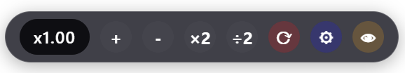

# TimeWarp – Control Time on Any Website

[](https://www.gnu.org/licenses/gpl-3.0)
[](https://raw.githubusercontent.com/YOUR_USERNAME/TimeWarp/main/TimeWarp.user.js) <!-- Replace with actual raw link -->

> **TimeWarp** is a powerful userscript that lets you control the speed of JavaScript timers, animations, and video playback on any website. Skip ad timers, speed up tutorials, or slow down animations – all with a modern UI, keyboard shortcuts, and a fully configurable settings panel.

 *(Optional: Add a screenshot of the control panel and settings modal)*

## ✨ Features

- ⏱️ **Timer speed control** – Hooks `setTimeout`, `setInterval`, and `requestAnimationFrame` to accelerate or slow down any time-based web logic.
- 🎬 **Video acceleration** – Overrides playback rate on all `<video>` elements (works on YouTube, Netflix, etc.).
- 🔧 **Built‑in Settings Panel** – Adjust all options from a beautiful modal, import/export your configuration, and reset to base defaults. No need to edit the script manually!
- 👁️ **Hide/Show Panel** – Temporarily hide the main UI with a single click. A floating **TimeWarp** button lets you restore it. Your hiding preference is saved across page reloads.
- ⌨️ **Keyboard shortcuts** – Arrow keys (enable/disable in settings), `Ctrl`/`Alt` + `=`, `-`, `0`, `9` for quick adjustments.
- 🎨 **Modern UI** – A sleek, draggable control panel with real‑time speed display, tooltips, and optional blur effect.
- 🧩 **Landscape / Portrait mode** – Choose horizontal or vertical button layout.
- 🔄 **Auto‑detects new content** – Works on dynamically added videos, iframes, and shadow DOM elements.
- ⚙️ **Highly configurable** – Speed limits, step sizes, UI transparency, and more – all changeable on‑the‑fly via the settings panel.
- 🧪 **Debug mode** – Log internal events to the console (disabled by default).

## 📦 Installation

1. Install a userscript manager like [Tampermonkey](https://www.tampermonkey.net/) or [Violentmonkey](https://violentmonkey.github.io/).
2. Because TimeWarp depends on [Everything‑Hook.js](https://greasyfork.org/scripts/372672-everything-hook), you have two options:
   - **Recommended:** Install TimeWarp directly from the link below – it includes the `@require` directive and will automatically fetch Everything‑Hook.
   - **Manual:** Install Everything‑Hook first, then install TimeWarp.
3. Click the following link to install **TimeWarp**:
   - [Install TimeWarp](https://raw.githubusercontent.com/YOUR_USERNAME/TimeWarp/main/TimeWarp.user.js) *(Replace with your actual raw GitHub URL)*
4. After installation, you’ll see a small control panel on the left side of the page (draggable). That’s it – you’re ready to warp time!

## 🎮 Usage

### UI Controls

| Button | Action |
|--------|--------|
| **x1.00** (display) | Shows current speed factor. Click to open a prompt for manual entry. |
| **+** / **-** | Increase/decrease speed by `BUTTON_STEP` (default 0.1). |
| **×2** / **÷2** | Multiply or divide current speed by `BUTTON_X2` / `BUTTON_HALF` (default 2 and 0.5). |
| **⟳** | Reset speed to 1.0 (normal). |
| **⚙** | Open the **Settings Panel** (see below). |
| **👁** | Hide the main TimeWarp panel. A floating **⏵ TimeWarp** button appears – click it to show the panel again. |

### Settings Panel

Click the gear icon (⚙) to open the settings modal. Here you can:

- Modify all configuration options (speed limits, step sizes, UI appearance, etc.).
- **Import** a previously exported JSON configuration file.
- **Export** your current settings as a JSON file (backup or share).
- **Reset to Base** – restore the original default configuration.
- **Save** – apply changes immediately (the UI rebuilds automatically).

The settings panel is resizable (grab the bottom‑right corner) and can be closed by clicking the red **✕** button or tapping outside the modal.

### Keyboard Shortcuts

| Keys | Action |
|------|--------|
| **↑** / **↓** | Increase/decrease speed by `ARROW_STEP` (default 0.1). *Arrow keys can be disabled in settings (`USE_ARROWS`).* |
| **Shift + ↑/↓** | Change speed by `ARROW_SHIFT_STEP` (default 1.0). |
| **Ctrl + ↑/↓** | Change speed by `ARROW_CTRL_STEP` (default 0.01). |
| **←** / **→** | Multiply by 2 / divide by 2 (only if arrow keys are enabled). |
| **Ctrl + =** | Multiply speed by 2 (same as ×2 button). |
| **Ctrl + -** | Divide speed by 2 (same as ÷2 button). |
| **Ctrl + 0** | Reset speed to 1.0. |
| **Ctrl + 9** | Open prompt to enter custom speed. |

*Legacy shortcuts (`Alt` variants) are also available – see `ENABLE_LEGACY_SHORTCUTS` in the settings panel.*

## ⚙️ Configuration Reference

All options can be changed live in the Settings Panel. For reference, here is the complete `CONFIG` object that ships with the script:

```javascript
const CONFIG = {
    // Speed limits
    MIN_SPEED: 0.1,      // Minimum playback speed (10%)
    MAX_SPEED: 16,       // Maximum playback speed (1600%)

    DEFAULT_SPEED: 1.0,  // Normal speed

    // Button steps
    BUTTON_STEP: 0.1,    // + / - increment
    BUTTON_X2: 2,        // ×2 factor
    BUTTON_HALF: 0.5,    // ÷2 factor

    // Arrow keys
    USE_ARROWS: false,   // Enable/disable all arrow key shortcuts
    ARROW_STEP: 0.1,
    ARROW_SHIFT_STEP: 1,
    ARROW_CTRL_STEP: 0.01,

    // Legacy shortcuts
    ENABLE_LEGACY_SHORTCUTS: true,

    // UI appearance
    UI_POSITION: { left: '20px', top: '20%' }, // Default position
    UI_BLUR: true,          // Backdrop blur
    UI_TRANSPARENCY: 0.85,  // Background opacity
    UI_SHOW_TOOLTIPS: true,
    UI_FLASH_DURATION: 300, // Speed flash overlay duration (ms)
    LANDSCAPE_MODE: true,   // true = horizontal, false = vertical

    // Video handling
    VIDEO_FORCE_RATE: true,
    VIDEO_OBSERVER: true,

    // Timer hooking
    HOOK_TIMERS: true,
    HOOK_RAF: true,
    HOOK_DATE: true,

    // Settings panel visibility (toggle only in code)
    ENABLE_SETTINGS_PANEL: true,

    DEBUG: false,
};
```

## 🐛 Troubleshooting

### Panel doesn’t appear?

- Make sure both **Everything‑Hook** and **TimeWarp** are installed and active.
- Check the browser console (F12) for errors.
- Try reloading the page.

### Video speed does not change?

- Some video players (e.g., YouTube) may periodically reset the playback rate. The script continuously forces the rate.
- Ensure `VIDEO_FORCE_RATE` is set to `true` in settings.
- If using an embedded player, the video might be inside an iframe – TimeWarp should detect it, but you may need to refresh the page.

### Timers not being hooked?

- `HOOK_TIMERS` must be `true`.
- Some websites use `Worker` timers or `postMessage` loops – these are not supported.

### Settings won’t save?

- Check that you didn’t accidentally set `ENABLE_SETTINGS_PANEL` to `false` in the code (the setting panel itself hides this option).
- After changing settings, always click **Save** – the panel rebuilds automatically.

### Keyboard shortcuts interfere with the page?

- Set `USE_ARROWS` to `false` in settings to disable arrow keys, or `ENABLE_LEGACY_SHORTCUTS` to `false` for Ctrl/Alt shortcuts.

---

## 🤝 Contributing

Contributions are welcome! Feel free to open issues or pull requests on the [GitHub repository](https://github.com/YOUR_USERNAME/TimeWarp). Areas for improvement include:

- Better support for Web Workers and `Performance` API.
- Additional UI themes.
- More granular control over which timers are hooked.

---

## 📄 License

TimeWarp is licensed under the **GNU General Public License v3.0**. See the [LICENSE](LICENSE) file for details.
